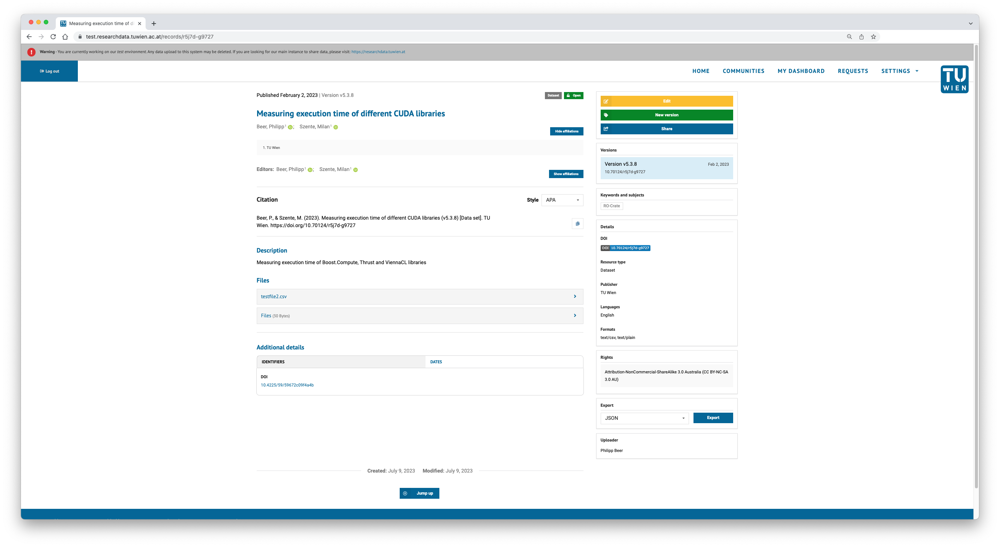
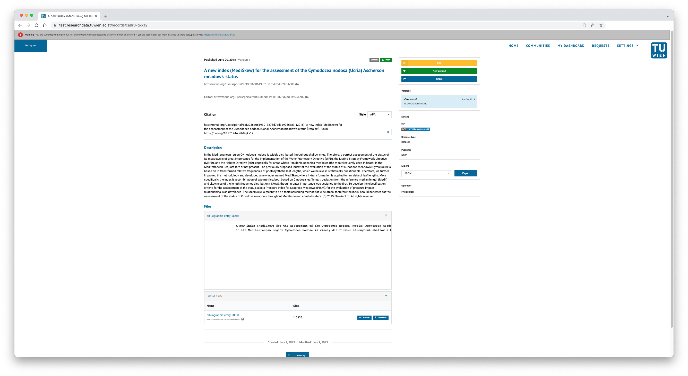

# RO-Crates Data Deposit

Command line tool to deposit a [RO-Crate directory](https://www.researchobject.org/ro-crate/) to an [InvenioRDM](https://inveniordm.web.cern.ch/). 

## Requirements

- [`Python 3.x`](https://www.python.org/downloads/)

## Setup

### Create an InvenioRDM API token
1. Register for an account on your chosen InvenioRDM instance. [Zenodo Sandbox](https://sandbox.zenodo.org/) can be used for testing.
1. Go to your profile and select Applications.
1. You should see a section called "Personal access tokens." Click the "New token" button.
1. Give the token a name that reminds you of what you're using it for (e.g. RO-Crate upload token)
1. Select the scopes deposit:write and deposit:actions.
1. Click "Create."
1. Copy the access token and continue with the next stage.

### Set up the environmental variables
1. copy and rename `.env.template` to `.env` in the same folder
1. open `.env` with a text editor and fill in your API key in the `INVENIORDM_API_KEY` variable
1. fill in the InvenioRDM base URL in the `INVENIORDM_BASE_URL` variable
  - in case of Zenodo Sandbox: use `https://sandbox.zenodo.org/`
  - in case of TU Wien test instance: use `https://test.researchdata.tuwien.ac.at/`
1. Run `source .env` to set the environment variables for the session

If you prefer to set the environment variables `INVENIORDM_API_KEY` and `INVENIORDM_BASE_URL` another way (e.g. in `~/.bashrc`), you can do that instead.

### Set up the Python environment
Run `python3 -m pip install -r requirements.txt`

## Usage

### General usage

Run `python3 deposit.py <ro-crate-dir>` with `<ro-crate-dir>` being the path to the RO-Crate directory. The record is saved as a draft and not published.

Run the same command with the `-p` option to publish the record.

Run `python3 deposit.py -h` for help.

### Manually verifying DataCite conversion before upload

This tool is a *best-effort* approach. After converting the metadata file, the resulting DataCite file is stored as `datacite-out.json` in the root directory. Users can adjust the generated DataCite file as needed, and can run the program in two stages to facilitate this:

First, run the program with the `--no-upload` option, to create the DataCite file without uploading anything to InvenioRDM:

`python3 deposit.py --no-upload <ro-crate-dir>`.

After verifying and adjusting the DataCite file, use the `-d` option to tell the program to use this file for upload and skip the process of conversion:

`rocrate_inveniordm -d <datacite-file> <ro-crate-dir>`.

## Mapping

The project aims at decoupling the definition of the mapping between RO-Crates and DataCite from code. This means, that users can quickly change/add/remove mapping rules without code changes. 

For more information, see [Mapping](docs/mapping.md).

## Results

### Minimal RO-Crate

The result of uploading the minimal RO-Crate as shown on [https://www.researchobject.org/ro-crate/1.1/root-data-entity.html#minimal-example-of-ro-crate](https://www.researchobject.org/ro-crate/1.1/root-data-entity.html#minimal-example-of-ro-crate) ([`/test/minimal-ro-crate`](./test/minimal-ro-crate/)) leads to the following result:

### Optimal RO-Crate

The result of uploading the [`/test/test-ro-crate`](./test/test-ro-crate/) directory looks like this in TUW's InvenioRDM repository:

### Real World RO-Crate

We tested the tool on a real-world RO-Crate ([https://reliance.rohub.org/b927e3d8-5bfd-4332-b14c-ab3a07d36dc6?activetab=overview](https://reliance.rohub.org/b927e3d8-5bfd-4332-b14c-ab3a07d36dc6?activetab=overview)). The result is shown below:

