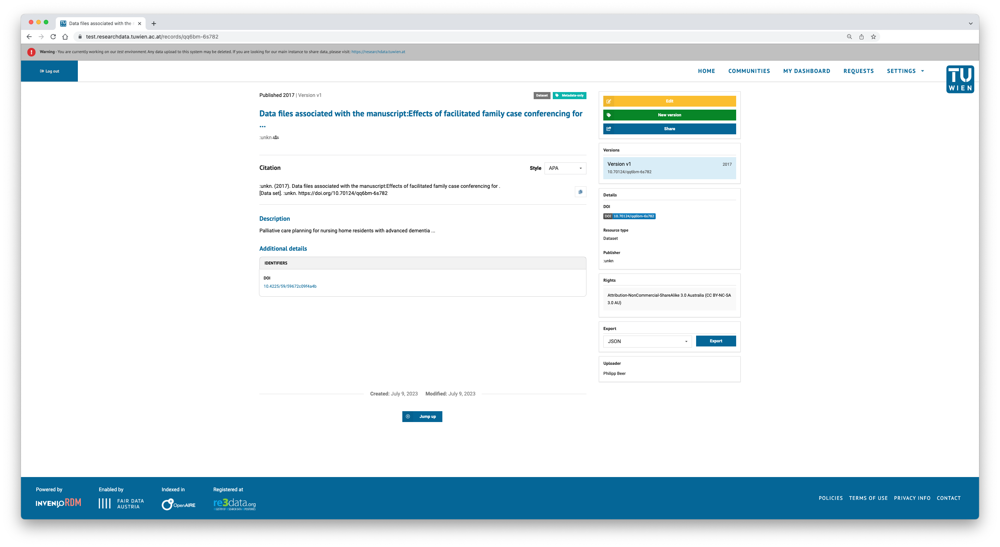

# RO-Crate InvenioRDM Deposit


Command line tool to deposit an [RO-Crate](https://www.researchobject.org/ro-crate/) to an [InvenioRDM](https://inveniordm.web.cern.ch/) repository. 

Originally developed as [`ro-crates-deposit`](https://github.com/beerphilipp/ro-crates-deposit) by Philipp Beer and Milan Szente. [](https://doi.org/10.5281/zenodo.8127644)

## Requirements

- [`Python 3.8.1`](https://www.python.org/downloads/) or higher

## Setup

### Create an InvenioRDM API token
1. Register for an account on your chosen InvenioRDM instance. [Zenodo Sandbox](https://sandbox.zenodo.org/) can be used for testing.
1. Go to your profile and select Applications.
1. You should see a section called "Personal access tokens." Click the "New token" button.
1. Give the token a name that reminds you of what you're using it for (e.g. RO-Crate upload token)
1. Select the scopes deposit:write and deposit:actions.
1. Click "Create."
1. Copy the access token and continue with the next stage.


### Set up the environmental variables

The package requires two environment variables to be set:
1. `INVENIORDM_BASE_URL` – the URL of your preferred InvenioRDM instance, e.g. `"https://sandbox.zenodo.org/"`
2. `INVENIORDM_API_KEY` – the API token you created in the section above.

 Run the following lines to set the environment variables:
```bash
export INVENIORDM_BASE_URL="your_preferred_instance_url"
export INVENIORDM_API_KEY="your_api_key"
```

You can also add the lines to your `~/.bashrc` file so that they are set whenever you start a shell, if you plan to use the package regularly.

If you want to change your target InvenioRDM instance, you can set the environment variables again using the same code.

## Usage

### General usage

Run `rocrate_inveniordm <ro-crate-dir>` with `<ro-crate-dir>` being the path to the RO-Crate directory. This will upload the record (including files and metadata) as a draft to your chosen InvenioRDM instance, and save the generated DataCite metadata as `datacite-out.json` in the current directory.

By default, the record is not published after upload. You can publish the record through the web interface of your chosen instance, or you can instead run the same command with the `-p` option to re-upload the crate into a new record and publish it immediately.

### Uploading as a zip file

Some repositories use a "flat" structure for records, where all the files are stored in the root of the archive and there is no directory structure. To preserve a directory structure, which can be important for the RO-Crate metadata file to be accurate, you can upload the crate as a single zip file instead – this can be achieved with the `-z` option (you do not need to pre-zip your crate). For example,
 
```
rocrate_inveniordm -z test-ro-crate
```

will result in an uploaded file called `test-ro-crate.zip`.

### Manually verifying DataCite conversion before upload

This tool is a *best-effort* approach. After converting the metadata file, the resulting DataCite file is stored as `datacite-out.json` in the root directory. You can adjust the generated DataCite file as needed, and can run the program in two stages to facilitate this:

First, run the program with the `--no-upload` option, to create the DataCite file in the current directory without uploading anything to InvenioRDM:

`rocrate_inveniordm --no-upload <ro-crate-dir>`.

After verifying and adjusting the DataCite file, use the `-d` option to tell the program to use this file for upload and skip the process of conversion:

`rocrate_inveniordm -d <datacite-file> <ro-crate-dir>`.

### Other options

Additional options can be found by running `rocrate_inveniordm --help`.

## Mapping

The project aims at decoupling the definition of the mapping between RO-Crates and DataCite from code. This means, that users can quickly change/add/remove mapping rules without code changes. 

To find out how each piece of RO-Crate metadata is converted to DataCite, see [How RO-Crate metadata is mapped to DataCite](docs/all-mappings.md).

For technical details on the implementation, see [Mapping](docs/mapping.md).

## Results

### Minimal RO-Crate

The result of uploading the minimal RO-Crate as shown on [https://www.researchobject.org/ro-crate/1.1/root-data-entity.html#minimal-example-of-ro-crate](https://www.researchobject.org/ro-crate/1.1/root-data-entity.html#minimal-example-of-ro-crate) ([`/test/minimal-ro-crate`](./test/minimal-ro-crate/)) leads to the following result:




### Optimal RO-Crate

The result of uploading the [`/test/test-ro-crate`](./test/test-ro-crate/) directory looks like this in TUW's InvenioRDM repository:


### Real World RO-Crate

We tested the tool on a real-world RO-Crate ([https://reliance.rohub.org/b927e3d8-5bfd-4332-b14c-ab3a07d36dc6?activetab=overview](https://reliance.rohub.org/b927e3d8-5bfd-4332-b14c-ab3a07d36dc6?activetab=overview)). The result is shown below:


